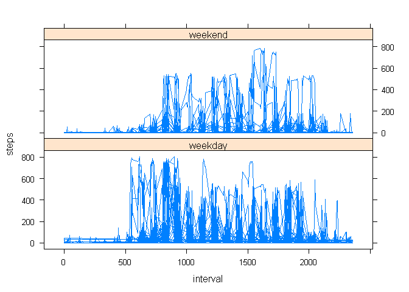

# Reproducible Research: Peer Assessment 1
Falko Richter  
Friday, September 18, 2015  

This is an R Markdown document for the peer assessment 1. 

## Loading and preprocessing the data


```
## [1] "C"
```

For the beginning, we read in the data and take a first look.


```r
dat  <- read.csv("activity.csv") 
head(dat)
```

```
##   steps       date interval
## 1    NA 2012-10-01        0
## 2    NA 2012-10-01        5
## 3    NA 2012-10-01       10
## 4    NA 2012-10-01       15
## 5    NA 2012-10-01       20
## 6    NA 2012-10-01       25
```

## What is mean total number of steps taken per day?


```r
df1=aggregate(steps~date, data=dat, sum, na.rm=FALSE)

hist(df1$steps, breaks=14,xlab="steps", main="steps per day")
```

 

```r
mean(df1$steps)
```

```
## [1] 10766.19
```

```r
median(df1$steps)
```

```
## [1] 10765
```

## What is the average daily activity pattern?


```r
df2=aggregate(steps~interval, data=dat, mean, na.rm=FALSE)
plot(df2$interval,df2$steps,type="l",main="average number of steps across all days",xlab="interval",ylab="steps")
```

 

Which 5-minute interval, contains the maximum number of steps?


```r
df2[(which(df2$steps == max(df2$steps))),]   
```

```
##     interval    steps
## 104      835 206.1698
```

## Imputing missing values

Reporting the total number of missing values in the dataset:

```r
colSums(is.na(dat)) 
```

```
##    steps     date interval 
##     2304        0        0
```

strategy for filling in the missing values is using the daily mean for that 5-minute interval:
we calculated these values above and stored them in "df2"  
  
We create a new dataset that is equal to the original dataset but with the missing data filled in, and we call it "dat2":


```r
dat2  <- dat
miss.vals  <- (which( is.na(dat$steps)))
for (k in 1:length(miss.vals)   )   
{      
  index  <- miss.vals[k]
  int.dat  <- (dat$interval[index])
  int.df2  <- which(df2$interval==int.dat)
  dat2$steps[index] <- df2$steps[int.df2]
}
```

the missing values should all be replaced by now:


```r
sum(is.na(dat2$steps))
```

```
## [1] 0
```

We now make a histogram of the total number of steps taken each day: 


```r
df3=aggregate(steps~date, data=dat2, sum, na.rm=FALSE)
hist(df3$steps, breaks=10)
```

 

Now calculate and report the mean and median total number of steps taken per day. Only the median differs slightly from the estimates from the first part of the assignment. There is no impact of imputing missing data on the estimates of the total daily number of steps, since we did not gain real additional data we could use.


```r
mean(df3$steps)
```

```
## [1] 10766.19
```

```r
median(df3$steps)
```

```
## [1] 10766.19
```

## Are there differences in activity patterns between weekdays and weekends?

First we will create a new factor variable in the dataset with two levels -- "weekday" and "weekend":  Additionally we are going to make a panel plot containing a time series plot of the 5-minute interval (x-axis) and the average number of steps taken, averaged across all weekday days or weekend days (y-axis):


```r
dat2$DATE <- as.Date(dat$date)
dat2$DAYS  <- (weekdays(dat2$DATE))

DAYTYPE  <- vector(mode="numeric", length=length(dat2$DAYS))
DAYTYPE[which((dat2$DAYS=="Saturday") | (dat2$DAYS=="Sunday"))]  <- 1
dat2$DAYS.f <- factor(DAYTYPE, labels = c("weekday", "weekend"))

library(lattice)
xyplot(steps ~ interval | DAYS.f, data = dat2, layout = c(1, 2), type="l")  
```

 
